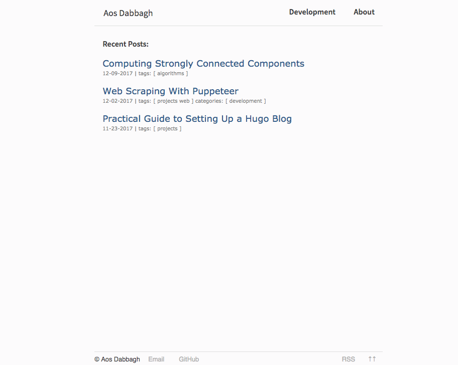
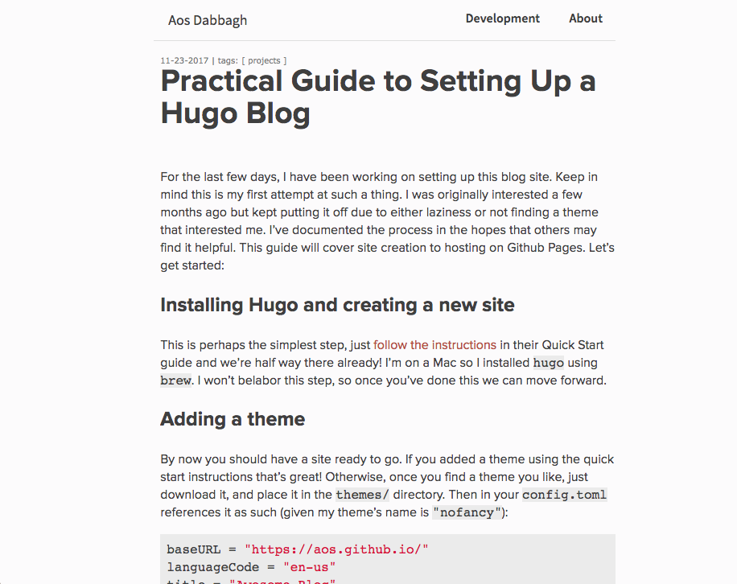

# Temple 

A Hugo theme focused on content, cleanliness, speed and responsiveness. The main
goal of this theme is to be simple and fast.

> This is a fork of [nofancy](https://github.com/gizak/nofancy) with many
improvements.

A live version of this theme can be found 
[on my personal blog](https://aos.github.io).

## Table of Contents
* Features
* Getting Started
* License

## Features
The main features of this theme include:
* Multiple categories as navigation tabs
* Tags and categories have their own pages
* Syntax highlighting with `highlightjs`
* Footer with variable social media links
* Google analytics enabled

